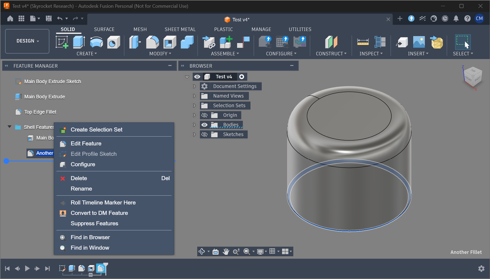

# Feature Manager

Feature Manager is an Autodesk Fusion add-in that adds a left-side, floating
feature/history manager for timeline features. It is a working fork of
`original-author/VerticalTimeline`, evolving toward a SolidWorks-style feature
tree while staying inside Fusion's API constraints.



The current codebase is a release-candidate development build. Core interaction
work is functional in local testing, but larger-file performance and some
context-menu command behavior still need broader Fusion testing before a public
release.

## Installation

No public release package has been published from this fork yet.

For local development, copy or sync this add-in into Fusion's add-in folder:

```text
%APPDATA%\Autodesk\Autodesk Fusion 360\API\AddIns\VerticalTimeline
```

The installed directory is still named `VerticalTimeline` for compatibility
with the current manifest and development setup. The visible add-in and palette
name is **Feature Manager**.

Fusion's general add-in installation flow is documented by Autodesk in
**How to install an add-in or script in Fusion 360**.

## Usage

The palette is shown using *File* -> *View* -> *Toggle Feature Manager*.

* Click an item to select it.
* Ctrl-click to toggle additional items.
* Shift-click to select a contiguous range.
* Double-click on an item to edit it.
* Click on an item text to rename it.
* Drag the blue history marker to roll the timeline.
* Drag feature or group rows to reorder them where Fusion allows.
* Right-click items for context-aware Feature Manager commands.
* Groups can be expanded/collapsed with the disclosure arrow.

Feature context menus currently include Fusion timeline-style commands such as
Create Selection Set, Edit Feature, Edit Profile Sketch where applicable,
Configure, Delete, Rename, Roll Timeline Marker Here, Convert to DM Feature,
Suppress/Unsuppress Features, Find in Browser, and Find in Window.

Sketch context menus include sketch-oriented commands such as Edit Sketch,
Extrude, Offset Plane, Redefine Sketch Plane, Select Sketch Plane, Slice Sketch,
Export DXF, Look At, Delete, Rename, and Find in Window.

Multi-selection supports contiguous feature grouping. Non-contiguous grouping is
intentionally rejected because Fusion timeline groups require contiguous items.

The add-in can be temporarily disabled using the *Scripts and Add-ins* dialog. Press *Shift+S* in Fusion 360™ and go to the *Add-Ins* tab.

## Release-Candidate TODO

Feature Manager is currently preparing its first public release as `v1.0.0`.
Before publishing:

* Run the manual regression checklist against the installed add-in.
* Verify sketch context-menu commands from Feature Manager selection context.
* Verify Edit Profile Sketch behavior across more feature types.
* Verify group create, rename, collapse, drag/reorder, and ungroup after add-in restart.
* Test timeline population and interaction on larger parametric models.
* Measure refresh performance for larger timelines.
* Package a clean release archive without local development-only files.

Known longer-term limitations and cleanup:

* Primitive feature selection/edit behavior still needs more testing, especially
  `BoxFeature`, `CylinderFeature`, and similar feature objects inside components.
* Feature icon and command mappings depend on Fusion resource paths and command
  IDs that may vary by Fusion version.
* Some Fusion timeline entities remain inaccessible through the public API, so
  exact native timeline parity may not be possible for every feature type.
* Error reporting should become less intrusive than modal message boxes.

## Fusion API Notes

The add-in still works around known Fusion API limitations:

* Some feature entities cannot be accessed through the API, including cases
  related to this reported issue: [[API BUG] Cannot access entity of "Move"
  feature](https://forums.autodesk.com/t5/fusion-360-api-and-scripts/api-bug-cannot-access-entity-of-quot-move-quot-feature/m-p/9651921)
* Document/workspace transition handling remains defensive because of historical
  `documentActivated` reliability issues: [[API BUG] Application.documentActivated
  Event do not raise](https://forums.autodesk.com/t5/fusion-360-api-and-scripts/api-bug-application-documentactivated-event-do-not-raise/m-p/9020750)

## Version

Current add-in version: `1.0.0`.

This is Feature Manager's first independent version line. It is intentionally
not based on the original VerticalTimeline version numbers.

## Changelog

* v1.0.0
  * Rebranded the visible add-in and palette as Feature Manager.
  * Added a transparent, floating Browser-style feature tree.
  * Added draggable vertical history marker support.
  * Added feature and group drag-reorder support where Fusion allows it.
  * Added built-in timeline group creation, rename, collapse, reorder, and ungroup workflows.
  * Added multi-selection with contiguous grouping rules.
  * Added context-aware right-click menus for features, sketches, groups, and multi-selection.
  * Added native Fusion resource icons and native-size menu icon rendering.
  * Added release-candidate documentation, development notes, and packaging guidance.

## License

This fork is distributed under the MIT License. The original VerticalTimeline
files were made available under `GPL-3.0-or-later OR MIT`; Feature Manager
elects the MIT option and retains the required upstream copyright notices.
